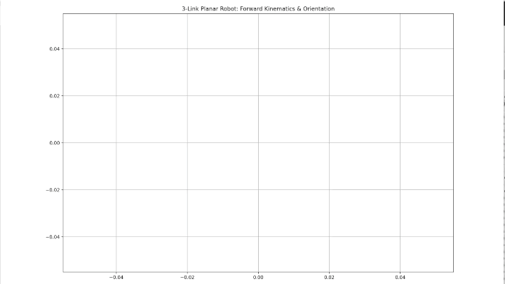
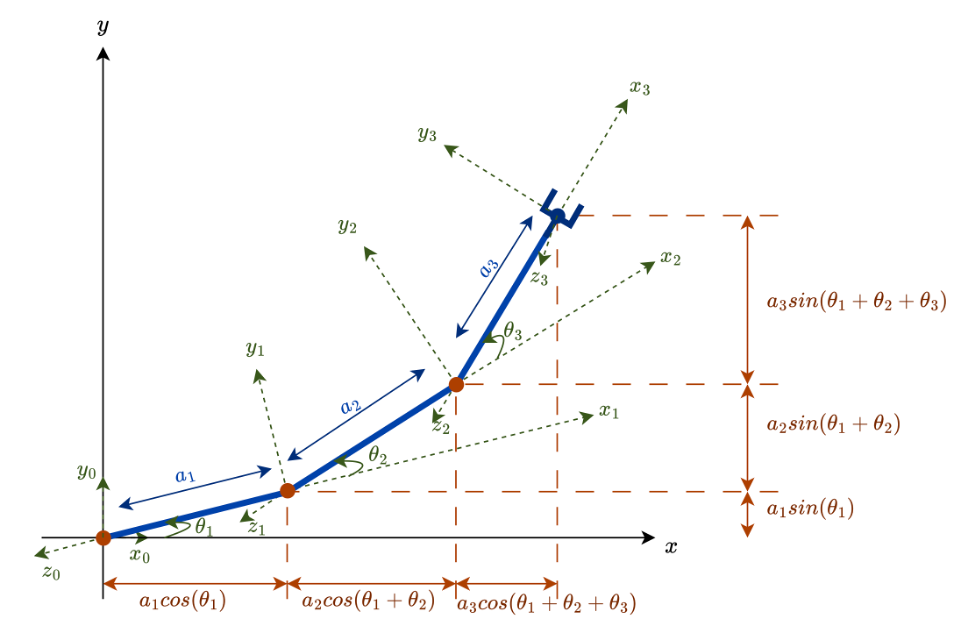

# 🦾 3R Planar Manipulator: Interactive Kinematics Engine

An interactive Forward Kinematics (FK) simulator for a 3-link planar robotic arm. This project demonstrates high-precision coordinate transformation, event-driven programming in Matplotlib, and rigorous software verification through unit testing.

To ensure a user-friendly experience, joint angles are input and displayed in Degrees, while the underlying Kinematics Engine performs all DH-matrix calculations in Radians for precision.

---
# 📖 Technical Report 

For a detailed technical report covering coordinate frame assignment, DH parameter table, and Kinematic modeling via DH convention, please see [Technical Report]()

### 🚀 Key Technical Specifications

*   **DH Parameter Modeling:** Leveraged the Denavit-Hartenberg (DH) convention to define the robot's kinematic chain, using a systematic approach to link frames and joint offsets.
*   **Homogeneous Transformations:** Implemented 4×4 transformation matrices (𝑖_𝑖−1𝑇) using NumPy, allowing for scalable calculation of the end-effector pose by multiplying individual link transforms.
*   **Interactive Simulation:** Users input three target joint angles ($\theta_1, \theta_2, \theta_3$). A **right-click event** triggers a smooth, real-time animation of the arm transitioning from its home position $(0,0,0)$ to the target configuration.
*   **Forward Kinematics Engine:** Implemented trigonometric modeling to map joint space to Cartesian space via DH parameters:
    *   $x = a_1 \cos(\theta_1) + a_2 \cos(\theta_1 + \theta_2) + a_3 \cos(\theta_1 + \theta_2 + \theta_3)$
    *   $y = a_1 \sin(\theta_1) + a_2 \sin(\theta_1 + \theta_2) + a_3 \sin(\theta_1 + \theta_2 + \theta_3)$

*   **Rigorous Verification:** A dedicated **Unit Testing** suite validates the DH-matrix outputs against geometric benchmarks to ensure mathematical integrity.
*   **Dynamic Visualization:** Real-time plotting using `Matplotlib` with an interactive event-loop for animation.

---
### 📐 The Mathematics (DH Convention)

The robot's geometry is defined by the following DH table, where $l_i$ represents the link lengths and $\theta_i$ represents the user-defined joint angles.

| Link | $\theta$ | $d$ | $a$ | $\alpha$ |
| :--- | :---: | :---: | :---: | :---: |
| **$l_0$** | $\theta_1$ | 0 | $a_1$ | 0 |
| **$l_1$** | $\theta_2$ | 0 | $a_2$ | 0 |
| **$l_2$** | $\theta_3$ | 0 | $a_3$ | 0 |

The final pose of the 3rd link (end-effector) is calculated by the product of three individual homogeneous transformation matrices:

$$^0_3T = ^0_1T(\theta_1) \cdot ^1_2T(\theta_2) \cdot ^2_3T(\theta_3)$$

After solving for $^0_3T$, we get,
 
$ \begin{bmatrix} x_{EE} \\ y_{EE} \\ z_{EE} \end{bmatrix}$ = $\begin{bmatrix} a_1 \cos(\theta_1) + a_2 \cos(\theta_1 + \theta_2) + a_3 \cos(\theta_1 + \theta_2 + \theta_3) \\ a_1 \sin(\theta_1) + a_2 \sin(\theta_1 + \theta_2) + a_3 \sin(\theta_1 + \theta_2 + \theta_3)\\ 0 \end{bmatrix} $

*Fig. Kinematic schematic of 3-DoF planar manipulator*

This matrix-based approach ensures the codebase is easily extensible to higher Degree of Freedom (DOF) robotic systems and is compatible with industry-standard simulation configurations.

---

### 🧪 Verification & Testing

This project follows **Test-Driven Development (TDD)** principles to ensure mathematical reliability - a critical requirement for physical robotic systems.

Run all tests in the */test* folder using:

    python3 -m unittests

To ensure the mathematical integrity of the DH-Parameter engine, the following scenarios are validated:

-   **Zero angle test:** Verifies the arm reaches its maximum horizontal extension at
-   **Vertical test:** Confirms link alignment and coordinate mapping when joints are at
-   **Folded link2 test:** Validates the engine's ability to handle overlapping links and coordinate subtraction.
-   **Folded lik3 test:** Specifically checks for mathematical singularities and precise end-effector positioning in a fully retracted state.

---

### 📂 Project Structure

*   **`src/main.py`**: Core kinematics engine (DH Parameters) and interactive Matplotlib GUI.
*   **`tests/unit_tests.py`**: Mathematical validation of $4 \times 4$ transformation matrices.
*   **`tests/test_plan.py`**: Functional testing of the event-driven animation and user input.

